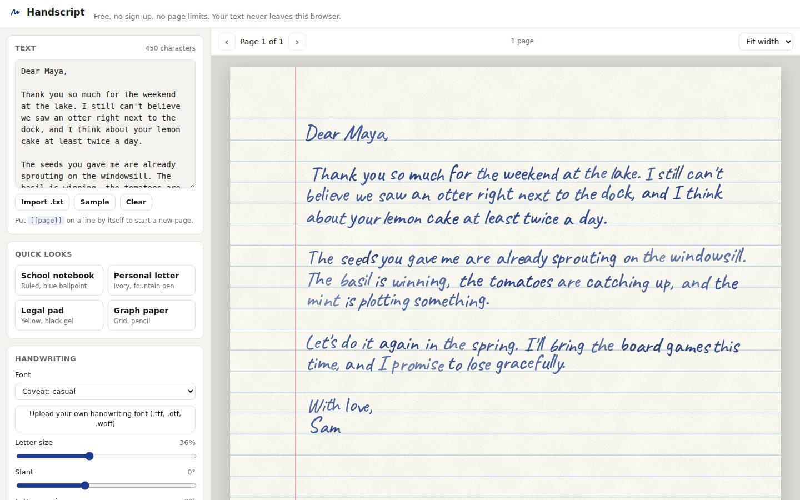
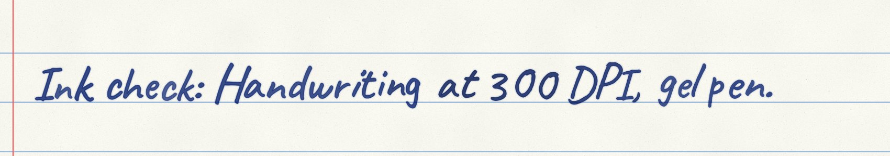

# Handscript

Turn typed text into realistic handwriting on paper, then download it as a PDF or PNG.
It is free, needs no sign-up, has no page limits and adds no watermark. Everything runs in
the browser, so text and fonts never leave the device.



Close-up of a 300 DPI export (fountain pen):



## Features

- **13 bundled handwriting fonts** (SIL OFL / Apache 2.0), covering Latin, Cyrillic,
  Devanagari, Korean, Japanese and Chinese. Arabic uses Aref Ruqaa as a fallback.
- **Your own handwriting**: upload a `.ttf`, `.otf`, `.woff` or `.woff2` font. It is loaded
  locally and never uploaded.
- **Mixed scripts**: characters the chosen font lacks fall back to a matching handwriting
  font and are resized to the main font's x-height. Right-to-left paragraphs are laid out
  from the right margin.
- **Realism engine**: baseline wobble, per-letter tilt, size and spacing, 3 fixed variants
  of each letter so repeated letters differ, slant drift, tilted lines, a ragged left edge,
  a hand that tires down the page, and ink flow and pressure variation. Connected cursive
  fonts get less per-letter jitter so the joins still meet.
- **Pens**: ballpoint, gel, fountain (ink bleed) and pencil (paper tooth).
- **Paper**: ruled, plain, grid or dotted. Sizes are A3–A6, US Letter, Legal, Tabloid and
  JIS B5, in portrait or landscape. Line spacing, colours, margin line, margins and paper
  grain are adjustable, plus an optional "scanned" look.
- **Unlimited length**: a 1,000,000-character document lays out to about 490 A4 pages
  in roughly 2.5 s. Put `[[page]]` on its own line to force a page break.
- **Export**: a multi-page PDF, or PNG (one file, or a ZIP of pages) at 150, 200 or 300 DPI.
- **Reproducible**: every random choice is seeded, so the preview matches the export
  exactly. "New variation" rolls a new seed.

## Run it

```bash
npm install
npm run dev        # http://localhost:5173
npm test           # unit tests (layout, segmentation, randomness)
npm run build      # static site in dist/
```

`dist/` is a plain static site, so it can be hosted anywhere (GitHub Pages, Netlify,
Cloudflare Pages, S3). No server is needed.

## How it works

```
text ─► tokenize ─► layout (pure) ─► pages of placed glyphs ─► render (Canvas 2D) ─► PNG / PDF
          │              │                                          │
  grapheme clusters   wrapping, pagination,                 paper + grain + rules,
  shaped-word units   seeded per-glyph jitter               ink layer (multiply blend),
  RTL / CJK breaks    fatigue, ink/pressure noise           bleed, pencil grain, scan look
```

| Path | Role |
| --- | --- |
| `src/engine/` | The portable engine. No DOM: it needs only a Canvas 2D context and a text measurer, so the same code can run in a Web Worker or on a server (for example with `@napi-rs/canvas`) for a future rendering API. |
| `src/engine/layout.ts` | Splits text into lines and pages. Samples the jitter for each glyph from seeds based on position, so editing one paragraph doesn't reshuffle the others. |
| `src/engine/render.ts` | Paints one page at any scale: paper, then the ink layer blended with multiply, then optional effects. |
| `src/engine/paper.ts` | Paper sizes, page geometry and the procedural paper texture. |
| `src/engine/segment.ts` | Grapheme clusters, whole-word units for scripts that need shaping, CJK break points, script detection. |
| `src/fonts.ts` | Font catalog, fallback stacks, per-script size matching and custom font upload. |
| `src/export/` | PDF (pdf-lib) and PNG/ZIP (fflate). Both load only when you first export. |
| `src/main.ts`, `src/ui/` | The editor UI. |

Layout units are CSS pixels at 96 DPI. A page is laid out once and rendered at any scale:
the screen's pixel density for the preview, or the chosen DPI for export.

## Roadmap

1. ~~Text box, OFL fonts, lined and plain paper, jitter engine, PNG/PDF export~~ (done,
   along with grid/dotted paper, pens, multi-page and custom fonts).
2. Rich text editor (Tiptap): headings, lists, tables, images and math (KaTeX).
3. Photo mode (perspective-warp the page onto a notebook photo), DOCX/PDF import, and an
   in-app builder that turns a scanned template into a custom font.
4. B2B API: headless rendering with the same engine, CSV batch personalisation, and
   print-ready PDFs (bleed, trim box, PDF/X).
5. Neural "your handwriting from one sample" (One-DM / DiffusionPen) as a GPU job whose word
   images slot into this layout engine.

Performance work to do: move layout into a Web Worker so very long documents
(hundreds of thousands of characters) don't block typing.

## Fonts and licensing

App code is MIT (see `LICENSE`). Bundled fonts come from [Fontsource](https://fontsource.org)
and keep their own licences (SIL OFL 1.1 or Apache 2.0, both of which allow commercial
use and server-side rendering). `npm run build` gathers them into `font-licenses.txt`,
which ships with the app. If you add fonts, check that the licence allows web-service
use. Many "free" fonts do not.
