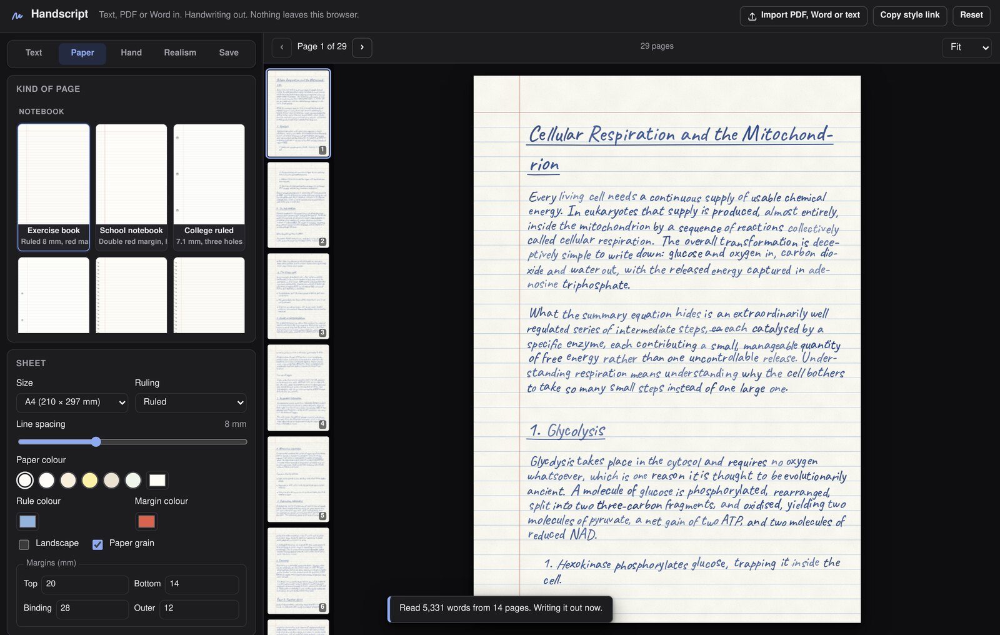
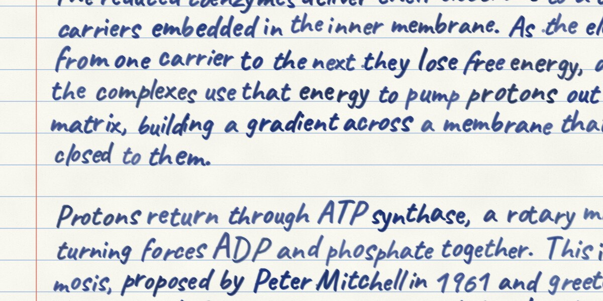

# Handscript

Turn typed text — or a PDF, or a Word file — into realistic handwriting on real paper,
then download it as a PDF or as images. It is free, needs no sign-up, has no page limit
and adds no watermark. Everything runs in the browser: documents, fonts and text never
leave the device. It comes two ways: a **website**, and an **Android app** that saves
straight to the phone and shares to WhatsApp, Drive or Classroom.



Close-up of the writing itself (fountain pen):



## What it does

**Reads your documents.** Drop in a PDF, a `.docx`, or a text file. A PDF has no
paragraphs — only thousands of positioned glyph runs — so the importer rebuilds the
document: it groups runs into lines, finds columns, joins words broken across a line
break, recovers headings from the size of the type, restores lists (including bulleted
lists whose bullets were drawn rather than written), carries sentences across page
boundaries, and drops the running headers, footers and page numbers that should not be
written out again. A 15-page PDF becomes about 30 handwritten pages in a couple of
seconds.

**Writes the equations out.** Mathematics does not survive being read back as text: a
displayed formula is a two-dimensional arrangement of glyph runs, so reading it line by
line turns one equation into three lines of nonsense. Displayed equations are found
instead — by the fonts they are set in (`CMMI`, `CMSY` and `CMEX` are TeX's maths fonts),
by being set in from the margin, and by being stacked more tightly than prose — and then
written out by hand where each piece stood: the letters and numbers in the hand, the
fraction bars, roots and big brackets traced and drawn with the pen. Handwriting fonts
stop at the alphabet, so Greek letters and about a hundred mathematical signs (α, Δ, ∫,
√, ≤, →, ∂, ∇, ℝ …) are drawn as pen strokes in the writer's own ink, fitted to the
hand's x-height and capital height. Superscripts and subscripts (`x^2`, `H_2O`, `x^{n+1}`,
or Unicode ² and ₂) are written small, raised and dropped, and a PDF's own are kept as
such.

**Draws the diagrams again, by hand.** A PDF never says "this is a figure" either, so
pages that draw something are rasterised, the text is masked out of the picture, and what
is left is treated as figures: connected blocks of drawing, joined up, measured, and cut
out, together with the labels, axis titles and caption that belong to them. Each figure is
then *traced*: thinned to the centre line of every stroke, followed from end to end and
through crossings, and simplified to the few points that describe it. Solid areas — bars,
pie slices, arrowheads — are set aside and shaded instead of traced, with each colour
getting its own hatching so two series can still be told apart. On the page, every line is
drawn once with the pen, a little bowed and unsteady, stopping short of a corner or running
past it; the labels are written in the page's own handwriting, where they stood. Word files'
pictures and pictures you drag in are traced the same way. Photographs stay photographs,
stuck on as prints, because no one draws a micrograph by hand. **Draw a diagram** opens a
sheet to sketch your own.

**Opens simple.** Three steps: your text (typed, pasted, or a PDF or Word file), a look
(six ready-made ones, each card a real preview), and Download. Handwriting, paper, pen,
ink, how the page was handed in, and how neat the hand is sit under the looks; every other
setting is one click away under **More options**.

**Writes it by hand.** 19 handwriting fonts, your own uploaded font — or, best of all,
**your own handwriting**: write each letter three times on the pad with a finger, a stylus
or the mouse, and the page is written in your hand, drawn back stroke by stroke with the
chosen pen. It cannot be matched to any font, because it is not one. A half-written hand
works too: letters not written yet are borrowed from a print hand, scaled to match. Hands
are kept in the browser and can be saved to a file. The layout engine is built around how
people actually write, not how a typesetter sets type:

- Letters are written with a pen, not filled in. Each letter of a font is drawn large and
  thinned back to the line through the middle of every stroke — the path the pen took —
  and that line is written with the chosen pen: thin, as a ballpoint line is, tapering where
  the pen touches down and lifts off, heavier on down-strokes, darker where two strokes
  cross, with now and then a bead of ink where the pen landed.
- No two copies of a letter are the same. A font draws every "e" identically; here each one
  is bent before it is drawn — the ascender a little taller, the bowl a little wider, the
  loop closing somewhere else — in two layers, as in a real hand: a few habitual forms of
  each letter, and the small differences of each copy.
- The hand is steady inside a word and wanders between words; it drifts slowly in size,
  slant and spacing over many lines, and gets messier down the page and through the
  document. Words never run together.
- Lines are filled the way a writer fills them: crammed a little, run past the margin, or
  hyphenated, rather than left conspicuously short. Letters crowd together as the margin
  approaches. A figure that will not fit is drawn at the top of the next page while the
  writing carries on underneath, rather than leaving half a page empty.
- Optional human corrections: a word started wrong and crossed out, one squeezed in above
  a caret, a dot of ink left where the pen rested.
- Typed characters a hand never writes — curly quotes, three kinds of dash, a one-glyph
  ellipsis, ligatures — are written the way a person writes them.
- Headings are written larger and underlined by hand, bullets are dabbed on, `**bold**` is
  pressed harder, `_italic_` leans further.
- Every page is written from a random seed of its own, so two people typing the same words
  never get the same page. **Write it again** rolls a new one.

**On the right paper.** 20 paper templates — exercise book, school notebook with a double
red margin, college and wide ruled, spiral-bound, torn-out, four-line practice paper,
French Séyès, graph, dot grid, engineering pad, legal pad, exam answer sheet, Cornell
notes, two columns, plain, ivory, recycled, diary, index card — and every part of them is
adjustable: ruling, spacing, colours, margins, binding holes, header and name/date lines,
page numbers printed or written by hand, mirrored margins on alternate pages, ink showing
through from the back, a torn edge.

**Written with a real pen.** Ballpoint, gel, rollerball, fountain, calligraphy nib, felt
tip and pencil. A nib is drawn as a nib — several passes across its width — so strokes
across it are broad and strokes along it are fine. Lines drawn with the pen (underlines,
diagrams, your own letters) thin where the pen touches down and lifts off. The ink goes
down unevenly, as it does on paper, bleeds into the paper, dries darker at the edge of a
gel or fountain-pen stroke, pools where the pen is set down, and pencil is broken up by the
tooth of the paper.

**Handed over how you like.** A phone-app scan, the way most homework is handed in — the
paper pushed to white, the ink to deep and saturated, the sheet still bowed, a sliver of
desk at one edge and the phone's shadow across a corner — which is how a page first looks.
Or a flatbed scan (crooked on the glass, grey cast, shade along the binding), a photo on a
desk (keystoned, bowed, warm light, the hand's shadow, grain, wood or table beneath), or
the flat page. Export a
multi-page PDF or PNG/JPEG images at 150–400 DPI, all pages or a range. The PDF carries
its title and nothing else: no creator or producer stamp.

The panel opens with the settings most people need — the paper, the hand, the pen — and
**Download PDF** sits in the top bar. **All settings** in the header brings out the rest: margins, printed
furniture, the ten realism weights, page ranges and the like. The choice is remembered.

## Project layout

```
website/   the editor and everything it is built from: engine, importers, UI, tests
app/       the Android app: the website's editor in a native shell (Capacitor)
```

The app does not keep a second copy of the editor. It is built from `website/`'s own
source with one module swapped: `#platform` (`website/src/platform.ts` on the web,
`app/src/platform.ts` in the app) holds the only code that differs, which is where a
finished file goes and what the Android back button does. Fix or improve the editor once,
in `website/`, and both get it.

Both folders are npm workspaces of the root `package.json`, so one `npm install` at the
top sets up both.

## The website

```bash
npm install
npm run dev        # http://localhost:5173
npm test           # unit tests: layout, paper, markup, PDF reflow, figures, tracing, letter shapes, hands
npm run build      # static site in website/dist/
```

`website/dist/` is a plain static site with relative asset paths, so it can be hosted
anywhere and from any sub-path. No server, no API keys, no backend.

- **GitHub Pages**: push to `main`; the included workflow (`.github/workflows/pages.yml`)
  builds and publishes it to https://devreddy1015.github.io/hand_plag/. This needs Pages
  set to **Source: GitHub Actions** (Settings → Pages). In the older "Deploy from a
  branch" mode, the `github-pages` environment only allows that one branch, and the
  deploy step is refused with "Branch main is not allowed to deploy to github-pages".
- **Netlify / Cloudflare Pages / Vercel**: build command `npm run build`, publish
  directory `website/dist`.
- **Anything else**: copy `website/dist/` onto any static host or CDN.

## The Android app

The app works offline: everything it needs is inside the APK. An exported PDF or image is
saved to the phone's **Documents/Handscript** folder, and the share sheet opens on it.

**Without installing anything**: every push to `main` builds the app on GitHub
(`.github/workflows/android.yml`). Open the run under **Actions**, download the
`handscript-apk` artifact, unzip it, and open `app-debug.apk` on the phone (allow
"install unknown apps" for the browser or Files app when Android asks).

**On your own machine** (needs JDK 21 and the Android SDK, which Android Studio installs):

```bash
npm install
npm run app:apk    # builds the editor, copies it into the app, and builds
                   # app/android/app/build/outputs/apk/debug/app-debug.apk
npm run app:open   # the same, then opens the project in Android Studio
```

The debug APK is for installing by hand. The Play Store wants a release bundle signed
with your own key: in Android Studio, **Build → Generate Signed App Bundle**.

The app's icon and splash screen are made from `app/assets/`; after changing those, run
`npx @capacitor/assets generate --android` in `app/` (on Node 24 or older).

## How it works

```
text ─► blocks ─► layout (pure) ─► pages of glyphs, strokes ─► render (Canvas 2D) ─► PDF / PNG
  │        │           │              and diagrams               │
PDF/DOCX  headings   lines, columns, pagination,          paper + ruling + furniture,
importer  lists      seeded per-glyph jitter,             ink layer (multiply blend),
+ figures emphasis   fill, hyphenation, corrections,      nib, bleed, pooling, traced
          diagrams   whole-line gaps for figures          diagrams, scan/photo finish
```

| Path | Role |
| --- | --- |
| `website/src/engine/` | The portable engine. No DOM: it needs only a Canvas 2D context and a text measurer, so the same code can run in a Web Worker or on a server (for example with `@napi-rs/canvas`) for a future rendering API. |
| `website/src/engine/layout.ts` | Splits blocks into lines and pages. Samples the jitter for each glyph from seeds based on position, so editing one paragraph doesn't reshuffle the others. |
| `website/src/engine/render.ts` | Paints one page at any scale: paper, then the ink layer blended with multiply, then the finish. Letters are drawn from their bent outlines, pen lines as pen strokes. |
| `website/src/engine/shapes.ts` | Letter outlines and the two-layer bend (habitual form, and this copy) that keeps any two copies of a letter from matching. |
| `website/src/engine/pen.ts` | The pens, and the outline of a pen stroke: tapering at each end, broad across a nib. |
| `website/src/engine/depth.ts` | Paper with depth: the groove each stroke presses into the sheet, and the other side of the sheet showing through, mirrored and broken up by the fibre. |
| `website/src/engine/symbols.ts` | Greek letters and mathematical signs as pen strokes, fitted to the hand they are written in. |
| `website/src/engine/finish.ts` | How the page was captured: phone-app scan, flatbed scan or photo — bowed paper, uneven light, shadows, enhancement and grain. |
| `website/src/strokefont.ts` | Turns each letter of a font into the pen strokes it was drawn with, by thinning it to its centre line. |
| `website/src/engine/sketch.ts` | Drawing a traced diagram by hand: bowed, unsteady lines, overshooting corners, closing overlaps, hatching per colour. |
| `website/src/engine/paper.ts` | Paper sizes, page geometry, printed furniture and the procedural paper texture. |
| `website/src/engine/templates.ts` | The paper templates and the features each one turns on. |
| `website/src/engine/markup.ts` | The small Markdown subset that maps onto things a hand can do. |
| `website/src/engine/segment.ts` | Grapheme clusters, whole-word units for scripts that need shaping, CJK break points, script detection, hyphenation points. |
| `website/src/import/reflow.ts` | Rebuilding a document from positioned text: lines, columns, paragraphs, headings, lists, running heads. Pure, and tested on its own. |
| `website/src/import/figures.ts` | Finding the figures: connected blocks of drawing, what is furniture and what is a diagram, which text belongs to which figure, and fitting a box to the ink. Pure, and tested on its own. |
| `website/src/import/math.ts` | Finding the displayed equations, so they can be copied out rather than mangled. Pure, and tested on its own. |
| `website/src/import/vectorize.ts` | Tracing a picture into pen paths: ink threshold, solid areas by opening, Zhang–Suen thinning, path following through junctions, spur pruning, simplification. Pure, and tested on its own. |
| `website/src/images.ts`, `website/src/store.ts` | The pictures a document refers to, decoded and ready to draw, traced if they are line art, and kept in IndexedDB so a document keeps its figures between visits. |
| `website/src/outlines.ts` | Reads the letter outlines out of each hand's WOFF files (opentype.js), loaded on first use. |
| `website/src/hands.ts`, `website/src/ui/pad.ts`, `website/src/ui/hand-dialog.ts` | Your own handwriting: the writing pad, the samples, and turning them into a hand. |
| `website/src/import/pdf.ts`, `docx.ts` | The readers themselves, loaded on first use. |
| `website/src/fonts.ts` | Font catalog, fallback stacks, per-script size matching, custom font upload. `@font-face` rules load per font, on demand. |
| `website/src/export/` | PDF (pdf-lib) and PNG/JPEG/ZIP (fflate). Both load only when you first export. |
| `website/src/main.ts`, `website/src/ui/` | The editor. |
| `website/src/platform.ts`, `app/src/platform.ts` | What differs between the website and the app: saving a file (a download, or Documents and the share sheet) and the back button. |

Layout units are CSS pixels at 96 DPI. A page is laid out once and rendered at any scale:
the screen's pixel density for the preview, or the chosen DPI for export. Every random
choice is seeded, so the preview matches the export exactly, and "New variation" rolls a
new seed.

Mixed scripts work: characters the chosen font lacks fall back to a matching handwriting
font and are resized to the main font's x-height, and right-to-left paragraphs are laid
out from the right margin.

## Performance

A 78,000-character document (49 A4 pages) lays out in well under a second and exports at
200 DPI in about eight seconds, roughly 145 ms per page. A 13-page PDF with 40 figures and
equations is read, and every figure traced, in under two seconds, and its 20 handwritten
pages export at 300 DPI in about five. Thumbnails are painted only when
they scroll into view, so a 300-page document opens as quickly as a one-page one.

Still to do: move layout into a Web Worker so documents of several hundred thousand
characters don't block typing.

## Roadmap

1. ~~Text box, OFL fonts, paper, jitter engine, PNG/PDF export~~ (done).
2. ~~PDF and Word import, paper templates, pens with real nibs, human corrections, scan
   and photo finishes~~ (done).
3. ~~Your own handwriting written on screen; diagrams and equations traced and drawn by
   hand; letters that never repeat~~ (done).
4. Rich text editor (Tiptap): tables, and typed maths (KaTeX) laid out as handwriting.
5. Your handwriting from a photo of a filled-in template, so real ink comes with it.
6. B2B API: headless rendering with the same engine, CSV batch personalisation, and
   print-ready PDFs (bleed, trim box, PDF/X).
7. Neural "your handwriting from one sample" (One-DM / DiffusionPen) as a GPU job whose
   word images slot into this layout engine.

## Fonts and licensing

App code is MIT (see `LICENSE`). Bundled fonts come from [Fontsource](https://fontsource.org)
and keep their own licences (SIL OFL 1.1 or Apache 2.0, both of which allow commercial
use and server-side rendering). `npm run build` gathers them into `font-licenses.txt`,
which ships with the app. If you add fonts, check that the licence allows web-service
use. Many "free" fonts do not.

PDF reading uses [pdf.js](https://mozilla.github.io/pdf.js/) (Apache 2.0), which runs in a
worker in the browser. Letter outlines are read with [opentype.js](https://opentype.js.org)
(MIT).
